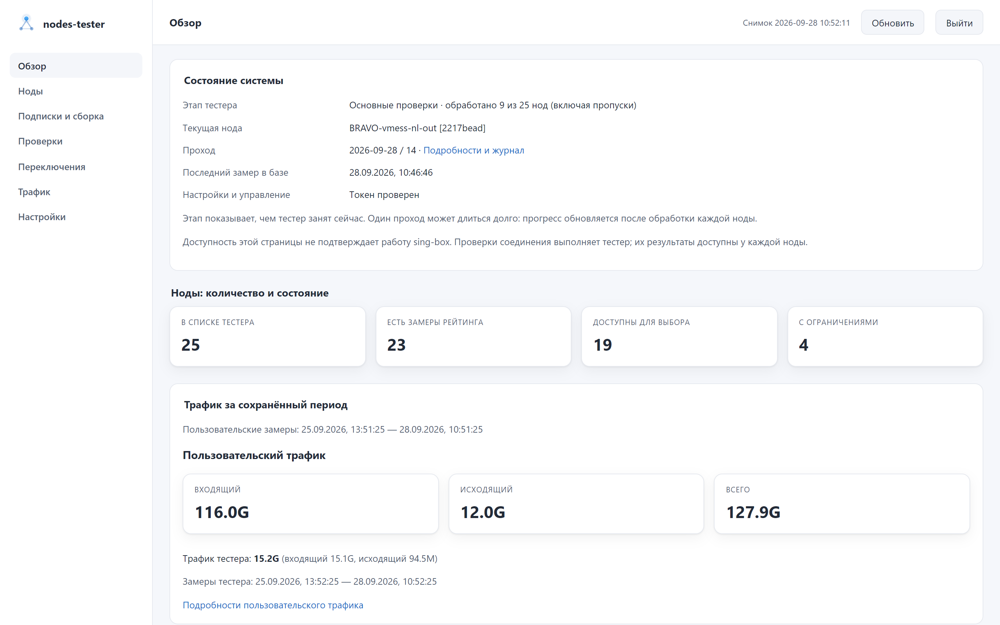

# nodes-tester

Управление прокси-нодами sing-box на OpenWrt: загрузка подписок, сборка нод и групп, проверки качества, автоматическое переключение и веб-админка.

Проект работает с уже установленным sing-box. Он не устанавливает прокси-ядро и не настраивает маршрутизацию роутера за пользователя. Для первого запуска нужны SSH-доступ и знание основ конфигурации sing-box.

<picture>
  <source media="(prefers-color-scheme: dark)" srcset="docs/screenshots/overview.png">
  <source media="(prefers-color-scheme: light)" srcset="docs/screenshots/overview-light.png">
  
</picture>

<p align="center">
  Обзор системы, ноды, результаты проверок и управление в одном интерфейсе.
  <a href="docs/screenshots/README.md">Все экраны</a>
</p>

## Начать

Быстрая установка на чистый OpenWrt 25.x — sing-box-lx и nodes-tester с минимальным конфигом
(TUN, sniff и перехват DNS без подписок, весь трафик пока напрямую), подробности в [инструкции](openwrt/README.md#быстрая-установка):

```sh
wget -qO- https://raw.githubusercontent.com/ancored/nodes-tester/master/openwrt/install.sh | sh -s -- 'https://provider.example/sub/YOUR-TOKEN'
```

Ручная установка:

1. Скачать пакет из [релизов](https://github.com/ancored/nodes-tester/releases).
2. Пройти [установку и первый запуск на OpenWrt](openwrt/README.md).
3. Открыть [руководство по админке и повседневной работе](docs/USAGE.md).

Актуальный релиз: [`v0.4.4-r3`](https://github.com/ancored/nodes-tester/releases/tag/v0.4.4-r3). Нужен sing-box 1.14 или новее с API-сервисом (`services[type=api]`). В нём есть `.apk` для OpenWrt 25.x. Для OpenWrt 24.10 нужен отдельно собранный `.ipk`. Пакет подписан ключом проекта и доступен из репозитория `apk` на GitHub Pages; подключение описано в [инструкции](openwrt/README.md).

## Как устроено обновление

```text
Подписки роутера → загрузка → raw/main.json → сборка → nodes.json
                                               + база и правила sing-box
                                               → проверка → применение → проверка связности

WH-подписки → загрузка → whnodes.json + клиентские базы
                                  → /etc/sing-box-clients/ → веб-сервер → клиентские ссылки
```

Конвейер защищает предыдущие данные при ошибке загрузки, проверяет итоговый конфиг перед заменой и возвращает рабочую версию, если после перезапуска пропала связность. Клиентская ветка собирает отдельные файлы и не переключает роутерный sing-box. Подробности и порядок ручного запуска приведены в [руководстве](docs/USAGE.md#как-обновляются-подписки-и-конфиги).

Админка показывает состояние тестера, историю измерений, трафик и переключения. В ней можно настроить подписки и группы, запустить конвейер, задать расписание, посмотреть журналы, отредактировать исходные файлы sing-box и управлять нодами. Страница «Правила» проверяет и применяет базу с пресетами без повторной загрузки подписок. Для изменений нужен токен администратора.

## Что важно знать

- Парсеры понимают XHTTP и AmneziaWG, но обычный sing-box их не принимает. Для этих нод
  нужен `sing-box-lx`; с обычным ядром их следует исключить на стадии `nodes_config`.
  См. [совместимость с ядрами sing-box](docs/SING_BOX_COMPATIBILITY.md).
- Сохранение подписок, применение новых нод и проверка текущих нод запускаются отдельно. Сохранение в админке не обновляет sing-box.
- Проверки создают сетевой трафик и скачивают тестовые файлы. Автоматическое переключение может менять рабочие селекторы; в шаблоне оно включено. Для знакомства с системой его можно отключить.
- Админка встроена в тестер. После установки сервис и веб-интерфейс выключены, пока вы их не настроите и не включите.
- Рабочие конфиги содержат секреты. Не публикуйте URL подписок, токены, базу статистики или полный диагностический вывод. Не выставляйте админку напрямую в интернет.

## Документация модулей

Основной README оставляет только маршрут первого запуска. Устройство компонентов описано
рядом с их кодом:

| Компонент | Описание |
|---|---|
| [`nodes_fetch`](nodes_fetch/README.md) | источники, парсеры, last-good и формат `raw_nodes.json` |
| [`nodes_config`](nodes_config/README.md) | фильтры, имена, CRC, группы и `nodes.json` |
| [`nodes_tester`](nodes_tester/README.md) | проверки, рейтинг, переключение, монитор и SQLite |
| [`nodes_admin`](nodes_admin/README.md) | конвейер, расписание и обновление правил |
| [`dashboard`](dashboard/README.md) | режимы HTTP-сервера, API, доступ и работа с файлами |
| [`web`](web/README.md) | исходники Vue, сборка и правила интерфейса |
| [`nodes_common`](nodes_common/README.md) | контракт raw, атомарная запись и блокировки |
| [`naming`](naming/README.md) | идентичность, протоколы, страны, регионы и CRC |
| [`scripts/router`](scripts/router/README.md) | применение, проверка, откат и клиентский конвейер |

Отдельно: [как собирается конфиг sing-box](docs/CONFIG_ASSEMBLY.md), [совместимость sing-box](docs/SING_BOX_COMPATIBILITY.md),
[повседневная работа](docs/USAGE.md), [модель безопасности роутера](docs/SECURITY_MODEL.md)
и [пакет OpenWrt](openwrt/README.md).

## Если устанавливаете из исходников

Нужен Python 3.8 или новее. Из корня репозитория выполните `python3 -m pip install -r requirements.txt`, создайте рабочие конфиги из [шаблонов](config/), подключите sing-box по той же схеме, что в инструкции OpenWrt, и запускайте `python3 -m nodes_tester -c config/config.json`. Вместо пакетной команды `nodes-tester fetch/config` используются `python3 -m nodes_fetch` и `python3 -m nodes_config`.

Готовая веб-статика включена в репозиторий; Node.js для запуска не нужен. OpenWrt-пакет собирается [скриптом SDK](openwrt/build.sh). Параметры команд показывает `--help`, а настройки описаны в [схемах](schemas/) и [шаблоне конфига](config/config.example.json).

## Лицензия

Copyright © 2026 Andrey Dyadyk

nodes-tester — свободная программа: её можно распространять и изменять на условиях
[GNU Affero General Public License](LICENSE) версии 3 либо (по вашему выбору) любой более
поздней версии (`AGPL-3.0-or-later`). Программа распространяется без каких-либо гарантий.
Если вы даёте доступ к изменённой версии по сети, например к админке, пользователи должны
иметь возможность получить её исходный код; ссылка «Исходный код» в админке ведёт на код
работающей версии.

Сторонние компоненты в составе админки и пакета OpenWrt — Vue и Vue Router (MIT),
[country-flag-emoji-polyfill](https://github.com/talkjs/country-flag-emoji-polyfill) (MIT;
изображения флагов — [Twemoji](https://github.com/twitter/twemoji), CC-BY 4.0) и
[PySocks](https://github.com/Anorov/PySocks) (BSD-3-Clause); их лицензии — в
[THIRD_PARTY_LICENSES](THIRD_PARTY_LICENSES).

Ключи расшифровки ссылок Happ в проект не входят: при наличии таких подписок они
скачиваются из источника, заданного пользователем (по умолчанию —
[Omegaplexx/hpwnr](https://github.com/Omegaplexx/hpwnr)).

sing-box и sing-box-lx (GPL-3.0) в проект не входят: тестер запускает установленный sing-box как
отдельную программу и обращается к его API.
