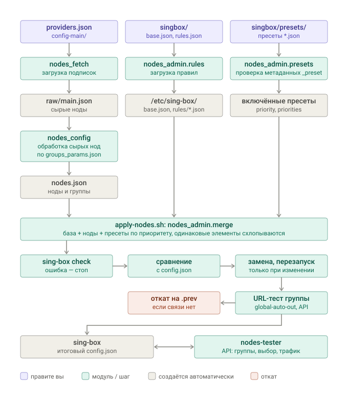

# Как собирается конфиг sing-box

[О проекте](../README.md) · [Руководство](USAGE.md) · [Скрипты роутера](../scripts/router/README.md)

Итоговый `/etc/sing-box/config.json` на роутере собирается из трёх цепочек: ноды из
подписок, база с наборами правил и пресеты правил. Все три сходятся в `apply-nodes.sh`.

<p align="center"></p>

## Входы

| Что | Где лежит | Кто обрабатывает | Результат |
|---|---|---|---|
| Подписки | `config-main/providers.json` | `nodes_fetch` — загрузка подписок | `raw/main.json` — сырые ноды |
| Рецепт сборки нод | `config-main/groups_params.json`, `user_nodes.json` | `nodes_config` — фильтры, имена, группы | `/etc/sing-box-subscribe/nodes.json` — ноды и группы `{group}-auto-out`, `{group}-auto-out-failsafe`, `global-auto-out`, `nodes-tester` |
| База | `singbox/base.json` | `nodes_admin.rules` — копирует | `/etc/sing-box/base.json` |
| Источники наборов правил | `singbox/rules.json` | `nodes_admin.rules` — загрузка правил | `/etc/sing-box/rules/*` |
| Пресеты правил | `singbox/presets/*.json` | `nodes_admin.presets` — проверяет `_preset`, отбирает включённые | включённые пресеты с приоритетами |

`singbox/` — каталог `/etc/nodes-tester/singbox/` пакетной установки; эти файлы правятся в
админке («Файлы sing-box», «Правила»). `config-main/` — «Подписки и сборка».

База содержит то, что нужно всегда: inbound'ы, общие DNS-серверы, `final`, API-сервис.
Правила маршрутизации и DNS, а также DNS-серверы и наборы правил, нужные только им, лежат
в пресетах. Пресет — фрагмент конфига sing-box (любые разделы) с метаданными `_preset`:
название, включён ли, приоритет, переопределения приоритета, нужные группы.

## Склейка

`apply-nodes.sh` склеивает входы своим склейщиком (`nodes_admin.merge`, вызов —
`python3 -m nodes_admin.presets assemble`). `sing-box merge` не используется: он склеивает
входы по именам файлов, не схлопывает одинаковые элементы и переписывает конфиг в каноничную
форму своей версии. Порядок источников:

```text
base.json          ← выше всех
nodes.json         ← ноды и группы
presets/*.json     ← включённые пресеты по priority (меньше — выше), при равенстве — по имени
```

```json
"_preset": { "priority": 300, "priorities": { "dns.rules": 150 } }
```

`priorities` переопределяет приоритет пресета для отдельного пути: здесь DNS-правила пресета
встают раньше, чем его правила маршрута. Внутри пресета порядок элементов не меняется.

| Что | Как склеивается |
|---|---|
| Объекты | рекурсивно |
| Массивы | элементы в порядке приоритета источников для этого пути |
| Элемент с `tag` | одинаковый объект схлопывается до первого; тот же `tag` с другим содержимым — ошибка с именами обоих источников |
| Элемент без `tag` | одинаковый схлопывается до первого, повтор пишется в журнал |
| Скаляры | `base.json` побеждает всегда; между пресетами — меньший приоритет; проигравшее другое значение пишется в журнал; разные значения при равном приоритете — ошибка |

Поэтому пресет сам объявляет нужные ему DNS-серверы и `rule_set`, даже если те же объекты
есть в другом пресете: совпадающие объекты схлопнутся. Ключ `_preset` в итоговый конфиг не
попадает. Содержимое входов проходит без изменений: например, `certificate_path` остаётся
путём, и sing-box сам перечитывает обновлённый сертификат.

## Библиотека пресетов

[`config/singbox/presets/`](../config/singbox/presets) — набор готовых пресетов, отправная точка
для своих правил; в пакете они лежат в `/usr/share/nodes-tester/examples/singbox/presets/`. Все
выключены: скопируйте нужные в `singbox/presets/`, подставьте свои значения и включите в
«Правилах». Наборы правил, на которые они ссылаются, перечислены в
[`rules.example.json`](../config/singbox/rules.example.json); при первой установке он становится
`singbox/rules.json`, а примеры локальных списков `us-domains.json` и `ru-also-domains.json`
копируются в `singbox/rules/`.

### Выходы и DNS-серверы

Пресеты ссылаются не на группы нод, а на выходы зон. Каждый выход объявляет отдельный пресет
роутера или база клиента, поэтому одна и та же логика подходит и роутеру, и клиенту:

| Выход | Назначение | На роутере | На клиенте |
|---|---|---|---|
| `ai-out` | Claude, OpenAI, Grok, Perplexity, пользователь `ai` | `out-ai` → `ai-auto-out` | роутер, пользователь `ai` |
| `google-out` | Gemini и адреса Google | `out-ai` → `ai-auto-out` | роутер, пользователь `global` |
| `us-out` | пользователь `us`, `us-domains` | `out-us` → `us-auto-out` | роутер, пользователь `us` |
| `global-out` | STUN браузеров | — | роутер, пользователь `global` |
| `home-out` | домашняя сеть и домашний IP | — | роутер, пользователь `ru-strict` |
| `direct-out`, `direct-lan`, `global-auto-out`, `nodes-tester` | прямой выход, LAN, все ноды, тестер | база и `nodes.json` | `global-auto-out` — ноды клиентской ветки |

Выход зоны — selector с одним элементом. Чтобы ИИ выходили через свой прокси, достаточно
поменять элемент `ai-out` в `out-ai`. DNS-серверы пресеты объявляют сами, на публичных адресах:
`dns-direct` — Яндекс DoT `77.88.8.8` (российские ответы для прямого трафика), `dns-ai`,
`dns-google`, `dns-us`, `dns-global` — DoH через свой выход, `dns-home` — через дом, `dns-wh` —
через ноды клиентской ветки. Замените их своими (например, профилями NextDNS) в копиях пресетов.

### Порядок

| Приоритет | Слой |
|---|---|
| 50 | выходы зон роутера |
| 90–130 | основа, блокировки, локальная сеть, недоверенный LAN, проверка IP |
| 150 | режим клиента, который решает всё сам («Белые списки») |
| 200–225 | ИИ и Google, ИИ-приложения, STUN |
| 280–310 | US, режим «Заграница», RU напрямую, пользователь `ru-strict` |
| 400 | пользователь `global` |
| 900–999 | `geoip` RU и BY, `route.final` |

ИИ стоят выше правил по `auth_user`: сервисы ИИ и Google уходят на свои выходы для любого
пользователя. Режим «Заграница» стоит после ИИ и US, но раньше RU-правил: российские сервисы
идут через дом, остальное — напрямую.

### Каталог

| Пресет | Где | Что делает |
|---|---|---|
| `out-ai`, `out-us` | роутер | объявляют `ai-out`, `google-out`, `us-out` из групп `ai` и `us` |
| `core` | роутер | `sniff`, перехват DNS, локальные адреса → `direct-lan`, тестер; домен URL-теста — через `bootstrap` |
| `untrusted-lan` | роутер | LAN вне доверенного сегмента → `direct-out`; см. [модель безопасности](SECURITY_MODEL.md#модель-доверия) |
| `block-ads`, `block-adult` | везде | реклама и трекеры, взрослый контент: `reject` и `NXDOMAIN` |
| `ip-check` | везде | `ifconfig.me` → `ai-out`: какой IP видят ИИ |
| `zone-ai` | роутер | пользователь `ai` → `ai-out`, без QUIC |
| `ai-services` | везде | Claude, OpenAI, Grok, Perplexity → `ai-out`, без QUIC |
| `ai-google` | везде | Gemini и адреса Google → `google-out`, без QUIC |
| `ai-google-smartdns` | везде | Gemini через прокси SmartDNS, остальные адреса Google → `google-out`; вместо `ai-google` |
| `zone-us` | везде | пользователь `us` и `us-domains` → `us-out` |
| `ru-direct` | везде | российские домены, Zoom, торренты, RDP → `direct-out` |
| `user-ru-strict`, `user-global` | роутер | пользователи `ru-strict` → `direct-out`, `global` → `global-auto-out` |
| `geoip-ru` | везде | адреса России и Беларуси → `direct-out` |
| `final-global` | роутер | `route.final` → `global-auto-out`, сервер `dns-global`; в базе задайте `dns.final: "dns-global"`; вместо пресета `direct` |
| `client-core` | клиент | `sniff`, перехват DNS |
| `android-no-package` | Android | соединения без пакета → `direct-out` (обход per-app-proxy через tun0) |
| `client-home-lan` | клиент | домашняя сеть: дома напрямую, вне дома — через `home-out` |
| `mode-whitelist` | клиент | `clash_mode` «Белые списки»: белый список напрямую, остальное — через ноды клиента |
| `android-ai-apps` | Android | приложения ChatGPT, Claude, Grok, Perplexity целиком → `ai-out`, включая голос |
| `android-browser-stun` | Android | STUN браузеров → `global-out`: WebRTC не раскрывает прямой IP |
| `mode-abroad` | клиент | `clash_mode` «Заграница»: RU через дом, остальное напрямую |
| `android-ru-apps` | Android | приложения из `ru-app-list` → `direct-out` |

Плейсхолдеры, которые нужно заменить: доверенный сегмент `192.168.1.0/25` в `untrusted-lan`,
SSID `Home-WiFi` и подсеть `192.168.1.0/24` в `client-home-lan`, `smartdns.example.com` в
`ai-google-smartdns`. Клиентские пресеты кладутся в `singbox/clients/presets/` (см. ниже).

## Пресеты клиентов

Клиентская ветка склеивает так же: `singbox/clients/base_<имя>.json` (выше всех), затем
`whnodes.json`, затем включённые пресеты `singbox/clients/presets/*.json` по приоритету. Набор
пресетов общий для всех клиентов из `clients.list`; различия клиентов остаются в их базах.

- Наборы правил. Клиенту локальные файлы роутера недоступны, поэтому `local` с путём в
  `/etc/sing-box/rules/` при сборке клиента превращается в `remote` с адресом раздачи из
  `singbox/clients/settings.json`. Тот же пресет годится и роутеру, и клиенту:

  ```json
  {"rules_url": "https://<router-domain>:8443/<секретный путь>/", "update_interval": "24h"}
  ```

  Получается `{"type": "remote", "tag": …, "format": "binary"|"source", "url": rules_url + имя файла,
  "update_interval": …}`; если база клиента описывает тот же набор так же, объекты схлопываются.
  Локальный путь вне `/etc/sing-box/rules/` или отсутствие `rules_url` — ошибка сборки.
- DNS-серверы с личными профилями (NextDNS и т. п.) держите в базе клиента: один тег с разным
  содержимым в двух источниках — ошибка склейки. Пресеты ссылаются на серверы по тегу.
- `requires.groups` сверяется с группами `whnodes.json`.

## Проверка и применение

После склейки:

1. `sing-box check` итогового файла; ошибка склейки или проверки — работающий конфиг не
   трогается. Админка делает ту же склейку и проверку при сохранении базы и пресетов.
2. Сравнение с работающим `/etc/sing-box/config.json`; совпадает — ничего не делается.
3. Замена конфига и перезапуск sing-box.
4. URL-тест группы `global-auto-out` через API-сервис sing-box; нет связности — возврат
   `config.json.prev` и перезапуск на нём.

Сохранение базы или пресета в админке прогоняет склейку и `sing-box check` так же, во
временном каталоге, и не записывает файл, который sing-box не примет. Клиентский пресет,
`clients/settings.json` и база клиента проверяются склейкой каждого клиента из `clients.list` с
текущим `whnodes.json` (база без `whnodes.json` сохраняется без проверки, как раньше).
`build-clients.sh` перед публикацией прогоняет `sing-box check` по каждому клиенту и по JSON из
`clients/publish/`; не прошедший проверку файл не публикуется, прежний остаётся.

## Кто запускает

| Команда | Что делает |
|---|---|
| `nodes-tester pipeline router` | все три цепочки: подписки, сборка нод, база и правила, применение; по расписанию или из «Конвейера» |
| `nodes-tester pipeline apply` | база и пресеты к текущему `nodes.json`, без загрузки подписок; кнопка «Применить» в «Правилах» |
| `nodes-tester pipeline clients` | WH-подписки → `whnodes.json` → конфиги клиентов; по расписанию или из «Конвейера» |
| `nodes-tester pipeline apply-clients` | базы клиентов и клиентские пресеты к текущему `whnodes.json`, без загрузки подписок; «Собрать клиентов» в «Правилах» → «Клиенты» |
| `--dry-run` у всех | собирает кандидата из редактируемых файлов и проверяет его, ничего не меняя |

## После сборки

`nodes-tester` работает с запущенным sing-box через API-сервис (`services[type=api]`):
читает группы и выбирает в них ноды, получает поток соединений для учёта трафика. Тесты
идут через отдельный inbound `nodes-tester-in` и плоский selector `nodes-tester`.

Клиентская ветка (`pipeline clients`) устроена отдельно: `config-wh/` → `whnodes.json`,
склейка с `singbox/clients/base_<имя>.json` и клиентскими пресетами тем же склейщиком
(`python3 -m nodes_admin.presets assemble --client-settings …`) → `/etc/sing-box-clients/`.
Роутерный sing-box она не трогает.
