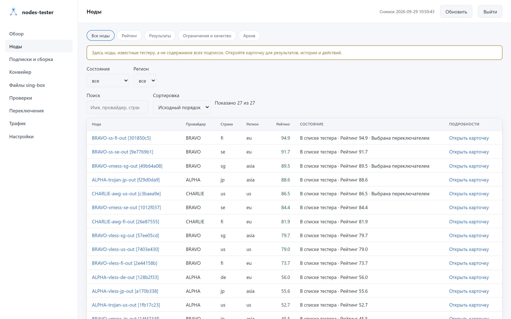
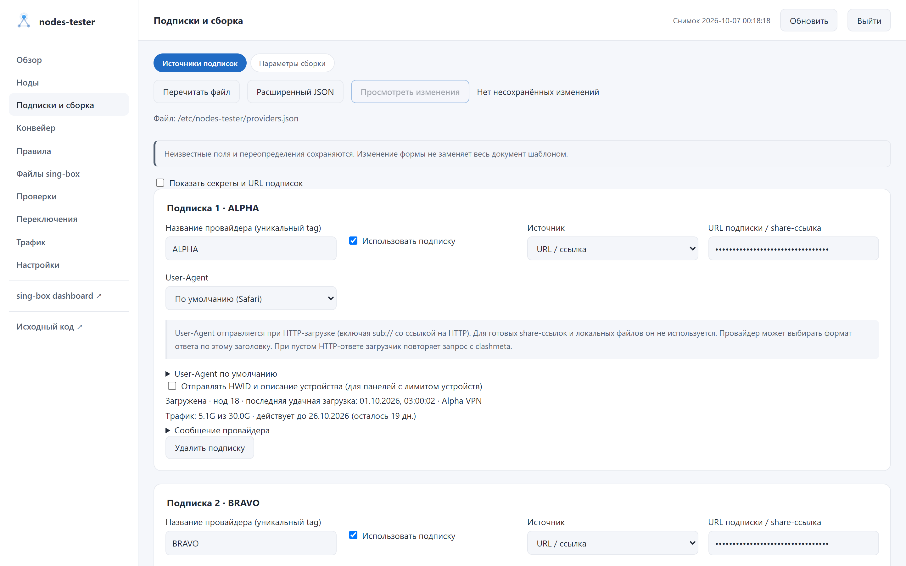
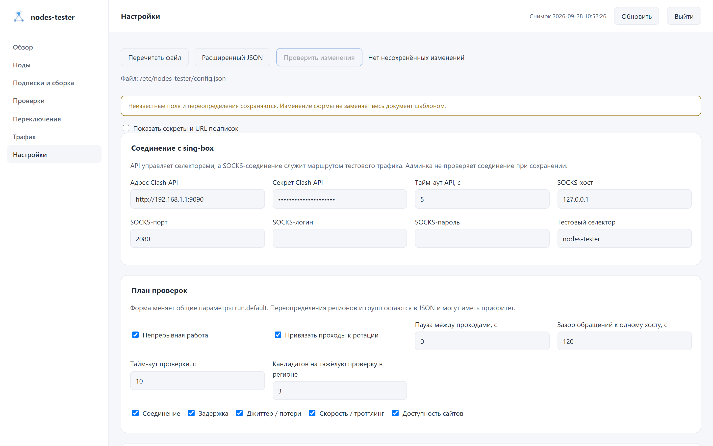
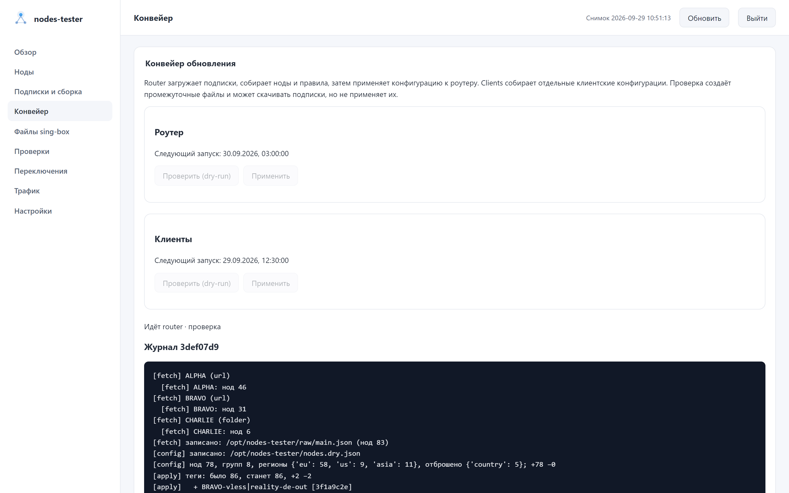
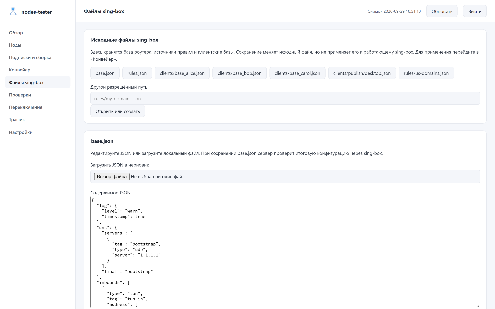
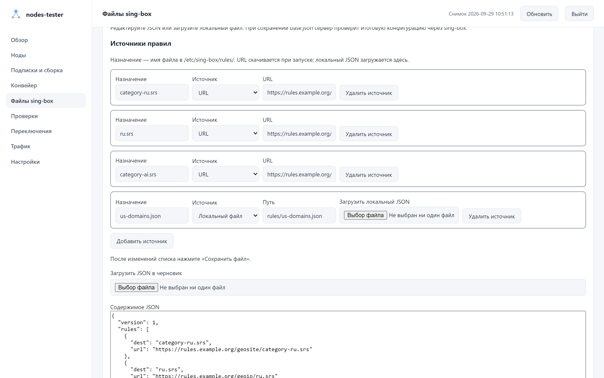
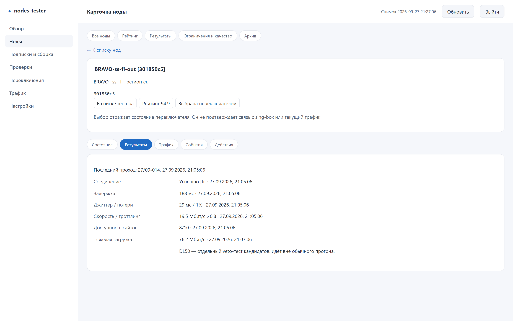
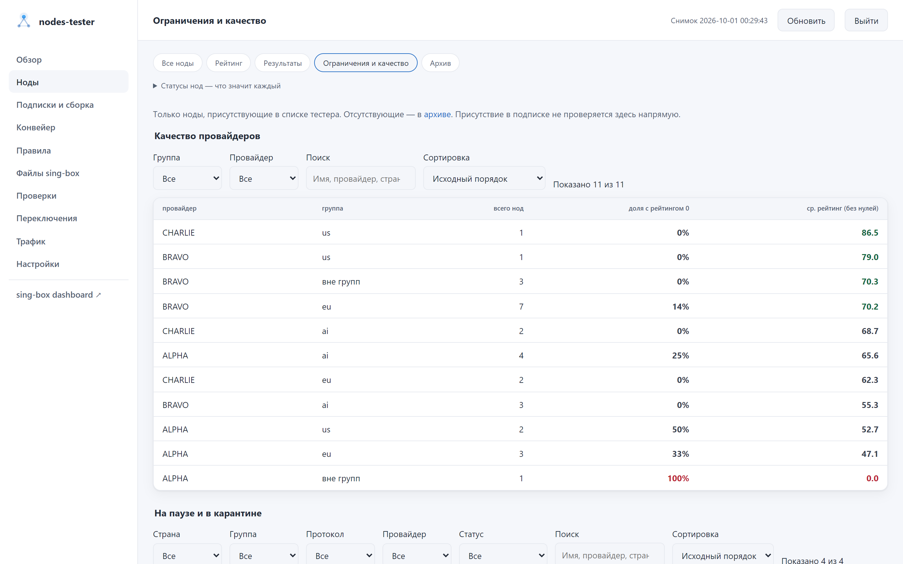

# Админка и повседневная работа

[О проекте](../README.md) · [Первый запуск на OpenWrt](../openwrt/README.md)

Руководство относится к пакету [`v0.4.3`](https://github.com/ancored/nodes-tester/releases/tag/v0.4.3). Обновление исходников на компьютере не обновляет установленный пакет.

<picture>
  <source media="(prefers-color-scheme: dark)" srcset="screenshots/nodes.png">
  <source media="(prefers-color-scheme: light)" srcset="screenshots/nodes-light.png">
  
</picture>

Скриншоты обновлены для версии 0.3.4, включая [группы, предпросмотр, пресеты и действия с нодой](screenshots/README.md#группы-правила-и-действия). Полная галерея доступна в [`docs/screenshots`](screenshots/README.md).

## Где что искать

| Задача | Раздел |
|---|---|
| Проверить состояние базы, тестера и выбор групп | Обзор |
| Найти ноду, понять ограничения, посмотреть измерения или выполнить действие | Ноды, затем карточка |
| Сравнить рейтинг, результаты и качество провайдеров | Подразделы «Нод» |
| Настроить источники и узнать, как применить их | Подписки и сборка |
| Запустить обновление, настроить расписание, открыть журнал | Конвейер |
| Включить пресет, проверить сборку и применить базу с правилами | Правила |
| Изменить базу sing-box, правила или клиентские файлы | Файлы sing-box |
| Запросить проход, посмотреть его этап и журнал | Проверки |
| Разобрать историю выбора групп | Переключения |
| Посмотреть пользовательский трафик за сохранённый период | Трафик |
| Настроить API sing-box, SOCKS, тесты, переключение и хранение | Настройки |
| Открыть официальную панель API-сервиса sing-box | sing-box dashboard (последний пункт меню) |

Поиск, сортировка, фильтры и страницы таблиц сохраняются в адресе. Автообновление не сбрасывает их. Карточка ноды связана с результатами и событиями по CRC, поэтому переименование тега не разрывает историю.

## Доступ

Нажмите «Войти для управления» и введите токен из `dashboard.token` рабочего `config.json`. При установке пакета он создаётся автоматически. Это не секрет API sing-box. Админка проверит токен на сервере; одного ввода строки недостаточно для доступа к действиям.

Токен хранится только до закрытия страницы, если не включить «Запомнить на этом устройстве». Эта опция сохраняет его в localStorage. «Выйти» удаляет сохранённый токен и закрывает редактор. Не включайте запоминание на чужом компьютере; используйте доверенную сеть или HTTPS, не выставляйте админку напрямую в интернет.

Пункт меню «sing-box dashboard» открывает официальную панель API-сервиса sing-box в новой вкладке. Админка отдаёт её статику с `{box_api.url}/dashboard/` по адресу `/sing-box-dashboard/`, поэтому у API-сервиса должен быть задан `dashboard`. После входа администратора админка сама записывает адрес и секрет `box_api` в настройки панели в браузере, и панель открывается без ввода секрета. Без входа панель спросит адрес и секрет сама. Секрет попадает в localStorage браузера; на чужом компьютере не входите или удалите сервер в настройках панели.

Отдельный `python3 -m dashboard` читает БД и позволяет редактировать файлы по токену, но не управляет Runner, не запускает проходы и не показывает живой журнал. Админка сообщает этот режим отдельно.

## Настройки и подписки

«Настройки» содержит формы подключения, плана проверок, автоматики, хранения и доступа. Форма подключения меняет первую тестовую группу; региональные и групповые переопределения остаются в расширенном JSON и могут иметь приоритет над общими параметрами.

«Подписки и сборка» редактирует файл из `dashboard.providers_file`. По умолчанию пакетной установки это `config-main/providers.json`. Поддерживаются URL/happ, файл и папка AWG; дополнительные поля существующего документа сохраняются. URL и секреты скрыты по умолчанию. Во вкладке «Параметры сборки» задаются группы и регионы. Условия одной группы объединяются через И, значения внутри условия - через ИЛИ. При включённом `fallback` группа без подходящих нод получает все ноды. Кнопка «Оценить состав групп» собирает группы по текущим данным подписок без записи `nodes.json`: показывает число нод и примеры в каждой группе, пересечения, сработавший `fallback` и группы, которые появятся или исчезнут. Неизвестные регионы и метки подсвечиваются рядом с полем.

XHTTP и AWG рассчитаны на `sing-box-lx`. Обычное ядро не примет созданный для них конфиг.
Фильтры настраиваются отдельно, в редакторе `groups_params.json` того же раздела. Для обычного
sing-box исключите `xhttp` и `wg`. Подробности приведены
в [руководстве по совместимости](SING_BOX_COMPATIBILITY.md).

Перед сохранением нажмите «Просмотреть изменения», проверьте список полей и подтвердите запись. Кнопка показывает список полей; проверка содержимого на сервере происходит при сохранении. Если файл изменили в другом окне или по SSH, сохранение будет отклонено до перечитывания. Навигация, перечитывание и закрытие страницы предупреждают о несохранённом черновике; черновик не является резервной копией.

После сохранения `config.json` перезапустите использующий его процесс. Для встроенной админки OpenWrt:

```sh
/etc/init.d/nodes-tester restart
```

У каждой подписки показано состояние последней загрузки: число нод, время последней удачной загрузки, ошибка. Если панель присылает метаданные, видны название, израсходованный трафик, срок действия и сообщение провайдера. HWID роутера для панелей с лимитом устройств указан под списком подписок; happ-подписки отправляют его всегда, URL-подписки — с флажком «Отправлять HWID». Для ссылок `happ://crypt…` нужны ключи приложения Happ: они в nodes-tester не входят и скачиваются из источника на панели «Ключи Happ» (по умолчанию — `src/keys.rs` проекта hpwnr на GitHub). Источник можно заменить своим URL или путём к файлу на роутере.

Сохранение `providers.json` или `groups_params.json` не скачивает подписки и не применяет конфигурацию к sing-box. После сохранения откройте «Конвейер», выполните проверку роутерной ветки, прочитайте журнал и примените результат. Если встроенный конвейер недоступен, используйте команды на роутере из раздела ниже. Дополнительные ноды (`user_nodes.json`) настраиваются через SSH.

Переключатель «Роутер / Клиенты» выбирает ветку: подписки и параметры сборки роутера лежат в `config-main/`, клиентской ветки — в `config-wh/` рядом с ним. Переключатель появляется, когда `dashboard.providers_file` указывает на `config-main/providers.json`. Изменения клиентской ветки применяются запуском режима «Клиенты» в «Конвейере» и не затрагивают sing-box роутера.

<table>
  <tr>
    <td width="50%">
      <picture>
        <source media="(prefers-color-scheme: dark)" srcset="screenshots/subscriptions.png">
        <source media="(prefers-color-scheme: light)" srcset="screenshots/subscriptions-light.png">
        
      </picture>
    </td>
    <td width="50%">
      <picture>
        <source media="(prefers-color-scheme: dark)" srcset="screenshots/config.png">
        <source media="(prefers-color-scheme: light)" srcset="screenshots/config-light.png">
        
      </picture>
    </td>
  </tr>
  <tr>
    <td><strong>Подписки и сборка</strong>: источники и проверка изменений.</td>
    <td><strong>Настройки</strong>: подключение, проверки, автоматика и хранение.</td>
  </tr>
</table>

## Как обновляются подписки и конфиги

Роутерная ветка выполняет шаги по порядку:

1. Загружает источники из `config-main/providers.json` в `<data_dir>/raw/main.json`. Если источник временно недоступен, загрузчик может сохранить его последние исправные ноды (last-good). Защита `min_ratio` не даёт заменить raw-файл резко сократившимся набором: конвейер продолжает работу с прежним raw и отмечает это в журнале.
2. Собирает `nodes.json` по `config-main/groups_params.json`. Затем обновляет правила из `singbox/rules.json`: двоичные `.srs` скачивает по URL, локальные JSON-источники берёт из `singbox/rules/`.
3. Объединяет фрагмент с `singbox/base.json` и проверяет кандидат командой `sing-box check`. Ошибка оставляет рабочий конфиг на месте.
4. Заменяет итоговый конфиг и перезапускает sing-box, только если итоговый файл изменился. Изменённые `.srs` и локальные source-наборы sing-box версии 1.10 и новее перечитывает без перезапуска. Проверка связности после применения возвращает предыдущий конфиг, если рабочая группа не отвечает.

На время роутерного применения тестер приостанавливает проверки и переключение. После завершения конвейера пауза сохраняется ещё 120 секунд. При работе через тот же прокси перезапуск sing-box может ненадолго прервать доступ к админке и SSH.

Клиентская ветка читает WH-источники из `config-wh/`, собирает `whnodes.json` и объединяет его с базами `singbox/clients/base_<name>.json` по списку `clients.list`. Готовые файлы, например `alice.json` и `bob.json`, попадают в `/etc/sing-box-clients/`. Настроенный отдельно веб-сервер раздаёт их клиентам по ссылкам; сам nodes-tester веб-сервер для этих файлов не настраивает. Файлы из `singbox/clients/publish/` копируются туда как есть, без объединения. Клиентская ветка не перезапускает роутерный sing-box.

## Конвейер

После входа с токеном откройте «Конвейер», выберите ветку `router` или `clients` и нажмите «Проверить» (`--dry-run`). Проверка скачивает источники и пишет промежуточные файлы в каталог данных. Для роутера она собирает кандидат и выполняет `sing-box check`, но не обновляет правила, не заменяет рабочий конфиг и не перезапускает sing-box. Для клиентов результат пишется отдельно, без публикации. Изучите журнал, затем нажмите «Применить» или выполните на роутере:

```sh
nodes-tester pipeline router --dry-run
nodes-tester pipeline router
nodes-tester pipeline clients --dry-run
nodes-tester pipeline clients
```

В этом же разделе задаётся время суток для каждой ветки по часам роутера. Оба задания изначально выключены. Для запуска каждые три часа укажите `00:00, 03:00, 06:00, 09:00, 12:00, 15:00, 18:00, 21:00`. После включения новое расписание действует со следующего времени запуска. При перезапуске тестера пропущенное задание выполняется один раз. Одновременно может идти только один конвейер, в том числе при запуске из терминала. Без встроенного расписания конвейер можно запускать из cron (`nodes-tester pipeline router` в `/etc/crontabs/root`), но не одновременно с ним.

История показывает ветку, ручной или плановый запуск, начало, конец и результат; откройте запись для полного журнала. Значение `ok` означает успех, `error` сообщает об ошибке, `busy` показывает занятость конвейера (код 75), `timeout` указывает на превышение времени. Статус `interrupted` появляется, если после сбоя процесса нет подтверждённого кода завершения. В `pipeline.json` можно изменить лимит времени; по умолчанию это 1800 секунд. Журналы лежат в `<data_dir>/pipeline/runs/`, история хранится в `<data_dir>/pipeline.db`. Храните `data_dir` на постоянном носителе.

<picture>
  <source media="(prefers-color-scheme: dark)" srcset="screenshots/pipeline.png">
  <source media="(prefers-color-scheme: light)" srcset="screenshots/pipeline-light.png">
  
</picture>

«Запросить внеплановую проверку» в разделе «Проверки» проверяет уже доступные тестеру ноды; эта кнопка не обновляет подписки. Текущий проход не прерывается, повторный запрос объединяется с ожидающим.

## Файлы sing-box

В разделе «Файлы sing-box» загрузите или отредактируйте `base.json`, `rules.json`, локальные `rules/*.json` и клиентские базы `clients/base_alice.json`, `clients/base_bob.json`. Перед записью `base.json` сервер объединяет его с существующим `nodes.json` и выполняет `sing-box check`; сначала соберите `nodes.json`, если его ещё нет. `rules.json` задаёт, какие правила обновлять: двоичные `.srs` допускаются только по HTTP(S) URL, а локальный источник должен быть JSON-файлом в формате source rule-set из `rules/`. Готовые файлы в `clients/publish/` публикуются без сборки.

Редактор показывает прошлые версии файла и позволяет восстановить выбранную. Перед сохранением он проверяет, не изменился ли файл после открытия страницы. Сохранение исходника не запускает конвейер: проверьте нужные ветки через dry-run и примените их отдельно. При изменении только правил перезапуск для sing-box 1.10 и новее не нужен; на старом ядре новые локальные rule-set будут прочитаны при следующем перезапуске.

<table>
  <tr>
    <td width="50%"><picture><source media="(prefers-color-scheme: dark)" srcset="screenshots/singbox.png"><source media="(prefers-color-scheme: light)" srcset="screenshots/singbox-light.png"></picture></td>
    <td width="50%"><picture><source media="(prefers-color-scheme: dark)" srcset="screenshots/singbox-rules.png"><source media="(prefers-color-scheme: light)" srcset="screenshots/singbox-rules-light.png"></picture></td>
  </tr>
  <tr><td>База, клиентские файлы и история версий.</td><td>Источники правил и локальные JSON-файлы.</td></tr>
</table>

## Правила sing-box

Схема сборки итогового конфига: [CONFIG_ASSEMBLY.md](CONFIG_ASSEMBLY.md).

Правила маршрутизации и DNS собираются из пресетов — отдельных файлов `presets/*.json` в
«Файлах sing-box». Пресет содержит всё, чего нет в базе: свои правила маршрута и DNS,
DNS-серверы и наборы правил. Например, пресет «US» направляет пользователя `us` и домены
`us-domains` в группу `us-auto-out`, а их DNS — в `dns-us`. Для работы пресету нужна
включённая группа `us` и inbound с пользователем `us` в базе.

Раздел «Правила» показывает пресеты по приоритету: название, описание, нужные группы и
переключатель. При переключении сервер собирает итоговый конфиг из базы, `nodes.json` и
включённых пресетов и выполняет `sing-box check`; если проверка не прошла, файл не
меняется, а причина показывается на странице. Работающий sing-box меняет только кнопка
«Применить»: она копирует базу, собирает конфиг, перезапускает sing-box при изменениях и
проверяет связность; журнал выводится на странице. «Проверить сборку» делает то же без
изменений. При возврате на страницу она показывает статус и журнал последнего прогона
`apply`; полная история — в «Конвейере».

Порядок правил задаёт `priority` (меньше — выше); `priorities` переопределяет его для
отдельного пути, например `{"dns.rules": 150}` ставит DNS-правила пресета в другое место.
Пресет может содержать любые разделы конфига и сам объявляет нужные ему DNS-серверы и наборы
правил: одинаковые объекты из разных пресетов схлопываются, а тот же тег с другим содержимым
— ошибка. Метаданные хранятся в ключе `_preset` и в итоговый конфиг не попадают. Как идёт
склейка — в [`CONFIG_ASSEMBLY.md`](CONFIG_ASSEMBLY.md#склейка). Примеры — в
`/usr/share/nodes-tester/examples/singbox/presets/`.

## Как читать состояние и действовать

Страна в таблицах показана флагом, код — во всплывающей подсказке. В «Результатах» колонка «IP» показывает значком, кому принадлежит выходной IP ноды: здание — дата-центр, телефон — мобильная сеть, дом — домашний провайдер; маска — IP известен как VPN или прокси. Флаг под значком — база относит IP к другой стране, чем показал тест соединения. Красные значки хуже для AI-сервисов; наведите курсор, чтобы увидеть IP и сеть. Последние колонки — Google AI, OpenAI и Claude AI: галка — сервис доступен, крест — нет, «?» — сбой сети, действует прошлый результат; под отметкой Google AI — страна, которой Google видит ноду. Протокол показан по частям, каждая на своей строке.

На «Обзоре» блок «sing-box» показывает, работает ли sing-box, и позволяет его остановить и запустить. Остановка — аварийный выход, если sing-box сломал сеть. Что будет с устройствами LAN, зависит от службы killswitch роутера: если она загружена, защищённые её правилами устройства остаются без интернета, пока sing-box не запустят; без неё трафик идёт напрямую через провайдера. Блок показывает, загружены ли правила killswitch и сколько пакетов отбито, и позволяет включить или выключить службу. Пока sing-box остановлен из админки, конвейер не применяет новый конфиг. Уведомления в Telegram или webhook настраиваются в «Настройках».

Таблицы фильтруются выпадающими списками: страна, группа, протокол, провайдер и поля конкретной таблицы (состояние, статус, причина). Группы берутся из текущего `nodes.json`; нода может входить в несколько групп. Список тестера, качество, ограничения и выбор переключателя показывают разные стороны состояния ноды. Отсутствие замеров не означает провал. Рейтинг оценивается по шкале от 0 до 100, его факторы нормированы от 0 до 1; физические значения смотрите в результатах с датой собственного замера. Тяжёлая загрузка может относиться к другому проходу.

В карточке ноды доступны действия с подтверждением:

- «Исключить»: бессрочно пропускать следующие проверки до снятия исключения. Это не удаление из подписки и не немедленная смена текущего селектора.
- «В карантин»: отложить проверки на настроенный срок `cooldown.garbage_hours`. При отключённом cooldown действие недоступно.
- «Снять ограничение»: разрешить повторную пробу со следующего подходящего прохода. Это не подтверждает исправность ноды.
- «Выбрать в группе»: сделать ноду активной в выбранной группе сейчас. Список содержит только группы, где нода — допустимый кандидат (положительный рейтинг, пройденные обязательные тесты группы, нет ограничений). Автоматика продолжает работать и впоследствии может изменить выбор.

Обзор отражает состояние переключателя, не независимую проверку селекторов sing-box. История содержит последние 200 записей с датой, группой, причиной и предыдущей нодой; значок у причины различает аварийную замену, аварию без замены, смену по качеству, ротацию, первый и ручной выбор, failsafe. Последняя запись группы не обязательно показывает её текущую активную ноду; авария без замены не считается успешным переключением.

Пользовательский трафик показан за доступный сохранённый период; тестовый трафик из него исключён. Отдельный блок показывает расход тестера за последние 24 часа: измеренные байты загрузочных тестов и выборку живых соединений. Эти показатели могут пересекаться, поэтому складывать их нельзя. Агрегаты по провайдерам, странам, протоколам и нодам строятся из всех сохранённых строк и фильтруются по стране, группе, протоколу и провайдеру; топ назначений содержит до 50 строк. Счётчики назначений накопительные. Журнал можно приостановить и отфильтровать; после длинной паузы часть старых строк может исчезнуть из серверного буфера.

<table>
  <tr>
    <td width="50%">
      <picture>
        <source media="(prefers-color-scheme: dark)" srcset="screenshots/node-card.png">
        <source media="(prefers-color-scheme: light)" srcset="screenshots/node-card-light.png">
        
      </picture>
    </td>
    <td width="50%">
      <picture>
        <source media="(prefers-color-scheme: dark)" srcset="screenshots/lifecycle.png">
        <source media="(prefers-color-scheme: light)" srcset="screenshots/lifecycle-light.png">
        
      </picture>
    </td>
  </tr>
  <tr>
    <td><strong>Карточка ноды</strong>: свежесть измерений, трафик, события и действия.</td>
    <td><strong>Ограничения и качество</strong>: пауза, карантин и состояние провайдеров.</td>
  </tr>
</table>

## Если что-то не работает

| Симптом | Что проверить |
|---|---|
| Админка не открывается | Сервис, `dashboard.enabled`, адрес/порт, LAN-доступ, `logread -e nodes-tester` |
| Токен не принимается | Токен действующего конфига; после изменения нужен перезапуск |
| База отсутствует или отключена | `storage.enabled`, путь `storage.db_file`, запуск тестера |
| Ошибка чтения или старые данные | Ошибку в шапке; устаревший снимок не подтверждает текущее состояние |
| Нет замеров | Тестовый selector, журнал, `storage.store_results`, завершение прохода |
| Новых нод нет после сохранения | Выполнены ли загрузка, сборка и применение к sing-box |
| Конвейер занят, код 75 | Дождитесь текущего запуска; проверьте историю и журнал. Одновременный запуск заблокирован |
| `timeout` | Проверьте последнюю стадию в журнале и лимит `pipeline.json`; оркестратор завершает группу процессов после защитного ожидания |
| Ошибка `sing-box check` | Проверьте базу, итоговый кандидат и совместимость протоколов с установленным ядром. Рабочий конфиг не заменён |
| После применения пропала связность | Прочитайте журнал проверки и отката. Конвейер возвращает предыдущий конфиг, если запрос через рабочую группу не проходит |
| Выбор в группе недоступен | Проверенный токен, встроенный Runner, switching, нода — кандидат хотя бы одной группы |

Перед обновлением пакета используйте `nodes-tester backup --stable`. Если нужна предыдущая версия, проверьте снимок командой `nodes-tester rollback --check`, затем выполните `nodes-tester rollback`. Порядок и состав снимка описаны в [инструкции по обновлению](../openwrt/README.md#6-обновить-пакет).

В [Issues](https://github.com/ancored/nodes-tester/issues) укажите версии OpenWrt, пакета и sing-box, действие и короткую обезличенную ошибку. Удалите URL подписок, ключи, токены и приватные адреса.
