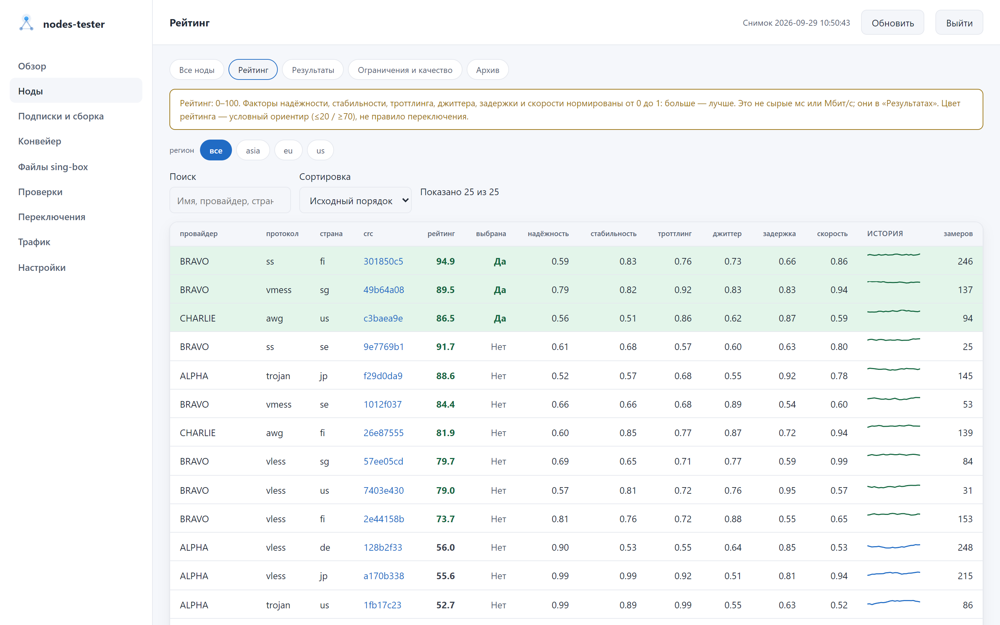
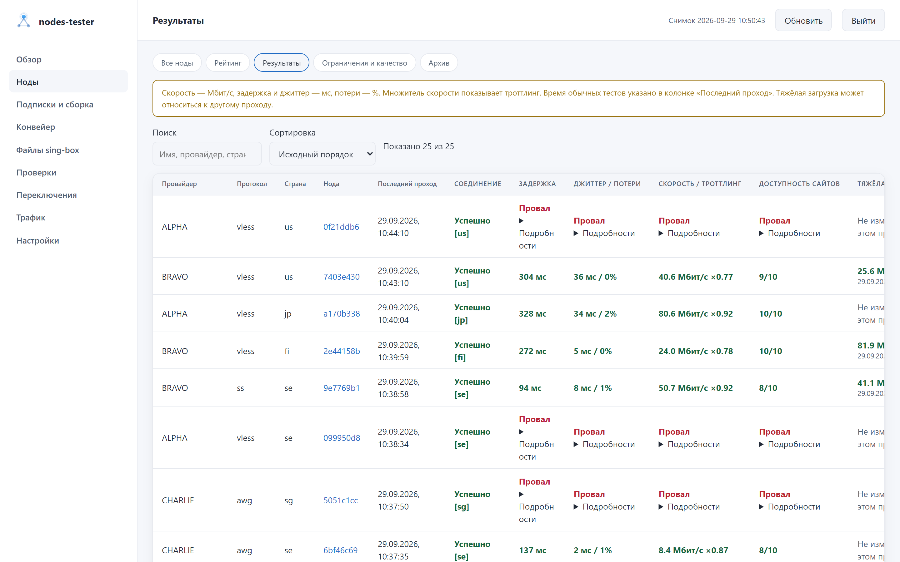
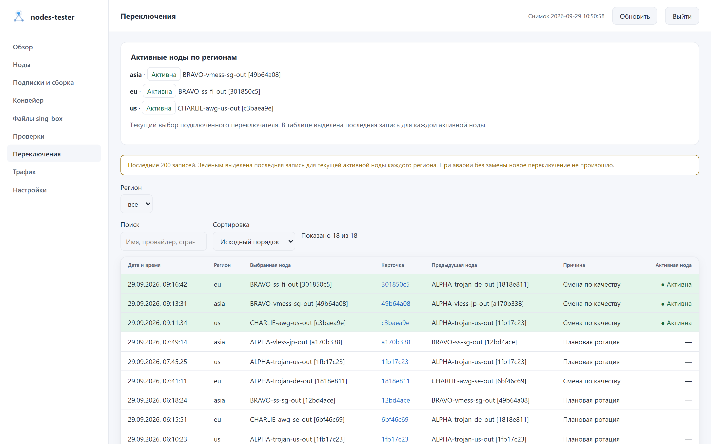
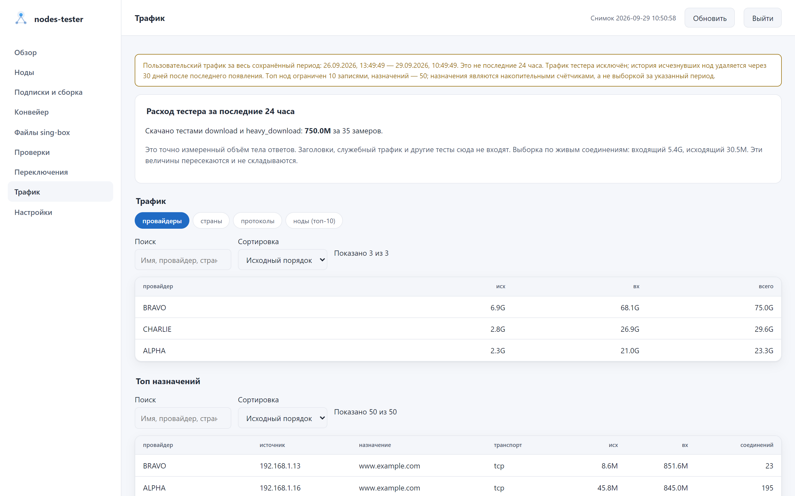
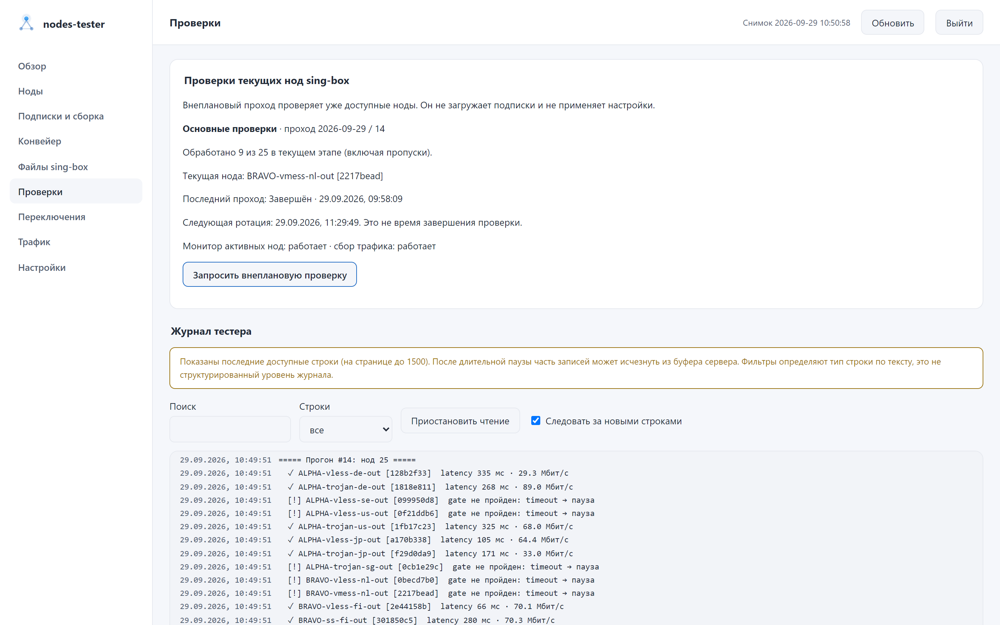
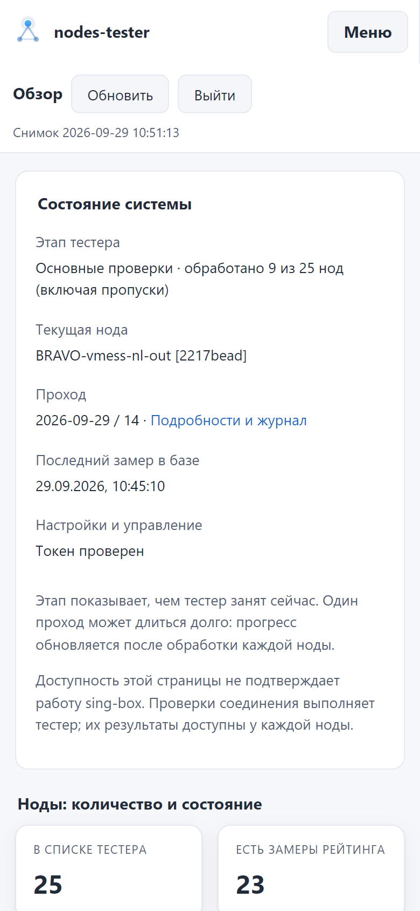
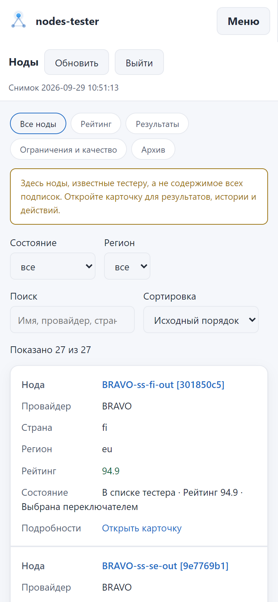

# Веб-админка nodes-tester

[О проекте](../../README.md) · [Руководство пользователя](../USAGE.md) ·
[Устройство dashboard](../../dashboard/README.md)

Изображения автоматически переключаются между светлой и тёмной темой GitHub. Нажмите на
скриншот, чтобы открыть исходный размер.

## Основные экраны

<table>
  <tr>
    <td width="50%">
      <a href="overview-light.png">
        <picture>
          <source media="(prefers-color-scheme: dark)" srcset="overview.png">
          <source media="(prefers-color-scheme: light)" srcset="overview-light.png">
          
        </picture>
      </a>
    </td>
    <td width="50%">
      <a href="nodes-light.png">
        <picture>
          <source media="(prefers-color-scheme: dark)" srcset="nodes.png">
          <source media="(prefers-color-scheme: light)" srcset="nodes-light.png">
          
        </picture>
      </a>
    </td>
  </tr>
  <tr>
    <td><strong>Обзор</strong> Состояние БД и тестера, сводные показатели и выбранные ноды регионов.</td>
    <td><strong>Все ноды</strong> Фильтры, поиск, сортировка, рейтинг и переход к карточке.</td>
  </tr>
  <tr>
    <td>
      <a href="node-card-light.png">
        <picture>
          <source media="(prefers-color-scheme: dark)" srcset="node-card.png">
          <source media="(prefers-color-scheme: light)" srcset="node-card-light.png">
          
        </picture>
      </a>
    </td>
    <td>
      <a href="rating-light.png">
        <picture>
          <source media="(prefers-color-scheme: dark)" srcset="rating.png">
          <source media="(prefers-color-scheme: light)" srcset="rating-light.png">
          
        </picture>
      </a>
    </td>
  </tr>
  <tr>
    <td><strong>Карточка ноды</strong> Состояние, измерения, трафик, события и действия в одном месте.</td>
    <td><strong>Рейтинг</strong> Итоговый балл и нормированные составляющие по регионам.</td>
  </tr>
  <tr>
    <td>
      <a href="results-light.png">
        <picture>
          <source media="(prefers-color-scheme: dark)" srcset="results.png">
          <source media="(prefers-color-scheme: light)" srcset="results-light.png">
          
        </picture>
      </a>
    </td>
    <td>
      <a href="lifecycle-light.png">
        <picture>
          <source media="(prefers-color-scheme: dark)" srcset="lifecycle.png">
          <source media="(prefers-color-scheme: light)" srcset="lifecycle-light.png">
          
        </picture>
      </a>
    </td>
  </tr>
  <tr>
    <td><strong>Результаты</strong> Физические метрики с временем каждого измерения.</td>
    <td><strong>Ограничения и качество</strong> Паузы, карантин и сводка по провайдерам.</td>
  </tr>
  <tr>
    <td>
      <a href="history-light.png">
        <picture>
          <source media="(prefers-color-scheme: dark)" srcset="history.png">
          <source media="(prefers-color-scheme: light)" srcset="history-light.png">
          
        </picture>
      </a>
    </td>
    <td>
      <a href="traffic-light.png">
        <picture>
          <source media="(prefers-color-scheme: dark)" srcset="traffic.png">
          <source media="(prefers-color-scheme: light)" srcset="traffic-light.png">
          
        </picture>
      </a>
    </td>
  </tr>
  <tr>
    <td><strong>Переключения</strong> Когда, почему и на какую ноду переключался регион.</td>
    <td><strong>Трафик</strong> Доступный период, направления и наиболее используемые ноды.</td>
  </tr>
</table>

## Настройка и управление

<table>
  <tr>
    <td width="50%">
      <a href="subscriptions-light.png">
        <picture>
          <source media="(prefers-color-scheme: dark)" srcset="subscriptions.png">
          <source media="(prefers-color-scheme: light)" srcset="subscriptions-light.png">
          
        </picture>
      </a>
    </td>
    <td width="50%">
      <a href="config-light.png">
        <picture>
          <source media="(prefers-color-scheme: dark)" srcset="config.png">
          <source media="(prefers-color-scheme: light)" srcset="config-light.png">
          
        </picture>
      </a>
    </td>
  </tr>
  <tr>
    <td><strong>Подписки и сборка</strong> Источники, секреты, формы и расширенный JSON.</td>
    <td><strong>Настройки</strong> Clash API, SOCKS, проверки, переключение, хранение и dashboard.</td>
  </tr>
  <tr>
    <td colspan="2">
      <a href="runs-light.png">
        <picture>
          <source media="(prefers-color-scheme: dark)" srcset="runs.png">
          <source media="(prefers-color-scheme: light)" srcset="runs-light.png">
          
        </picture>
      </a>
    </td>
  </tr>
  <tr>
    <td colspan="2"><strong>Проверки</strong> Этап прохода, очередь, последний результат и живой журнал.</td>
  </tr>
  <tr>
    <td colspan="2">
      <a href="pipeline-light.png">
        <picture>
          <source media="(prefers-color-scheme: dark)" srcset="pipeline.png">
          <source media="(prefers-color-scheme: light)" srcset="pipeline-light.png">
          
        </picture>
      </a>
    </td>
  </tr>
  <tr><td colspan="2"><strong>Конвейер</strong> Ручной запуск, расписание, история и журнал.</td></tr>
  <tr>
    <td width="50%">
      <a href="singbox-light.png">
        <picture>
          <source media="(prefers-color-scheme: dark)" srcset="singbox.png">
          <source media="(prefers-color-scheme: light)" srcset="singbox-light.png">
          
        </picture>
      </a>
    </td>
    <td width="50%">
      <a href="singbox-rules-light.png">
        <picture>
          <source media="(prefers-color-scheme: dark)" srcset="singbox-rules.png">
          <source media="(prefers-color-scheme: light)" srcset="singbox-rules-light.png">
          
        </picture>
      </a>
    </td>
  </tr>
  <tr>
    <td><strong>Файлы sing-box</strong> База, клиентские конфиги и история версий.</td>
    <td><strong>Источники правил</strong> Список загрузок и локальные JSON-файлы.</td>
  </tr>
</table>

## Мобильный интерфейс

  <a href="mobile-overview-light.png">
    <picture>
      <source media="(prefers-color-scheme: dark)" srcset="mobile-overview.png">
      <source media="(prefers-color-scheme: light)" srcset="mobile-overview-light.png">
      
    </picture>
  </a>
  &nbsp;
  <a href="mobile-nodes-light.png">
    <picture>
      <source media="(prefers-color-scheme: dark)" srcset="mobile-nodes.png">
      <source media="(prefers-color-scheme: light)" srcset="mobile-nodes-light.png">
      
    </picture>
  </a>

Интерфейс сохраняет те же разделы и действия, а таблицы перестраиваются для узкого экрана.
